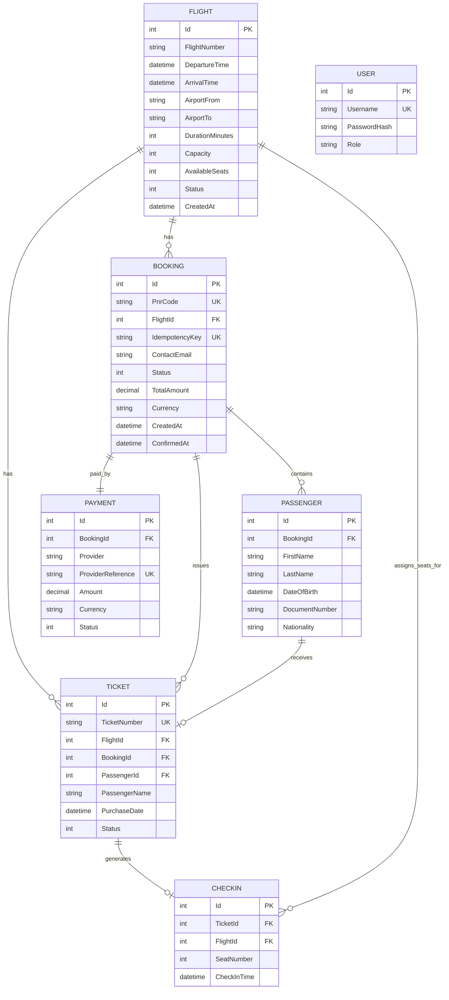

# Service Oriented Airline Ticketing System

SE4458 Midterm Project - Airline Company API

## Overview

This project is a backend-only REST API for an airline ticketing system. It uses .NET 8, ASP.NET Core Web API, Entity Framework Core, PostgreSQL on Supabase, JWT authentication, Swagger, and an Ocelot API Gateway.

The project follows a layered structure:

- API: controllers, Swagger, authentication middleware
- Application: DTOs and service interfaces
- Infrastructure: EF Core DbContext, PostgreSQL configuration, service implementations
- Domain: core entities and enums
- Gateway: Ocelot routing and rate limiting

## Deployment

Backend API Swagger URL:

- To be updated after final Azure deployment.

API Gateway URL:

- To be updated after final Azure deployment.

Before deploying the gateway, update `src/AirlineTicketing.Gateway/ocelot.json` so every `DownstreamHostAndPorts.Host` value points to the deployed backend API host.


## API Endpoints

| Requirement | Endpoint | Auth | Paging |
| --- | --- | --- | --- |
| Add Flight | `POST /api/v1/Flight` | Yes | No |
| Add Flight by File | `POST /api/v1/Flight/upload` | Yes | No |
| Query Flight | `GET /api/v1/Flight/query` | No | Yes, max size 10 |
| Buy Ticket | `POST /api/v1/Ticket` | Yes | No |
| Check-in | `POST /api/v1/CheckIn` | No | No |
| Query Flight Passenger List | `GET /api/v1/Flight/passengers` | Yes | Yes, max size 10 |
| Login | `POST /api/v1/Auth/login` | No | No |
| Create Booking / PNR | `POST /api/v1/Bookings` | No | No |
| Get Booking / PNR | `GET /api/v1/Bookings/{pnrCode}` | Yes | No |
| Liveness Health Check | `GET /health/live` | No | No |
| Readiness Health Check | `GET /health/ready` | No | No |

The original academic endpoints are preserved. The booking endpoints extend the project toward a more realistic airline backend with PNR, passenger, ticket, payment, and idempotency support.

### Production-oriented booking request

`POST /api/v1/Bookings` supports the optional `Idempotency-Key` header. Repeating the same key returns the existing booking instead of creating duplicate tickets or consuming extra seats.

```json
{
  "flightNumber": "TK100",
  "departureDate": "2026-06-10T00:00:00Z",
  "contactEmail": "passenger@example.com",
  "contactPhone": "+905551112233",
  "totalAmount": 2500,
  "currency": "TRY",
  "passengers": [
    {
      "firstName": "Ada",
      "lastName": "Yilmaz",
      "dateOfBirth": "1998-05-01T00:00:00Z",
      "documentNumber": "U1234567",
      "nationality": "TUR"
    }
  ]
}
```

## Authentication

JWT authentication is used for protected endpoints.

Default seeded user for local/demo testing:

- Username: `admin`
- Password: `admin123`

Protected endpoints require:

```http
Authorization: Bearer <token>
```

## API Gateway

Ocelot routes gateway paths under `/gateway/*` to backend `/api/v1/*` routes.

Example routes:

| Gateway Path | Backend Path |
| --- | --- |
| `POST /gateway/auth/login` | `POST /api/v1/Auth/login` |
| `POST /gateway/flights` | `POST /api/v1/Flight` |
| `GET /gateway/flights/query` | `GET /api/v1/Flight/query` |
| `POST /gateway/flights/upload` | `POST /api/v1/Flight/upload` |
| `GET /gateway/flights/passengers` | `GET /api/v1/Flight/passengers` |
| `POST /gateway/tickets` | `POST /api/v1/Ticket` |
| `POST /gateway/checkin` | `POST /api/v1/CheckIn` |
| `POST /gateway/bookings` | `POST /api/v1/Bookings` |
| `GET /gateway/bookings/{pnrCode}` | `GET /api/v1/Bookings/{pnrCode}` |
| `GET /gateway/health/live` | `GET /health/live` |
| `GET /gateway/health/ready` | `GET /health/ready` |

Rate limiting is configured on `GET /gateway/flights/query`.

- Demo setting: 3 requests per minute
- Required client id header: `Client`
- This was intentionally kept short for Swagger/demo verification. For a production interpretation of the assignment, change the period to one day.

## Data Model

Core entities:

- Flight
- Ticket
- CheckIn
- Booking
- Passenger
- Payment
- User

Relationships:

- One Flight has many Tickets.
- One Ticket belongs to one Flight.
- One Ticket can have one CheckIn.
- One CheckIn belongs to one Ticket and one Flight.
- One Flight has many Bookings.
- One Booking belongs to one Flight.
- One Booking has many Passengers.
- One Booking has many Tickets.
- One Booking has one Payment.
- One Passenger can be linked to one Ticket inside the booking.
- Users are used for authentication.

Important constraints:

- `FlightNumber + DepartureTime` is unique.
- `TicketNumber` is unique.
- `Username` is unique.
- `PnrCode` is unique.
- `IdempotencyKey` is unique when provided.
- `Payment.ProviderReference` is unique.
- A single booking can contain at most 9 passengers.
- `TicketId` is unique in `CheckIns`, so one ticket can only be checked in once.
- `FlightId + SeatNumber` is unique in `CheckIns`, so the same seat cannot be assigned twice on the same flight.
- `AvailableSeats` cannot be negative and cannot exceed `Capacity`.
- Cancelled, departed, and arrived flights are excluded from query, ticket purchase, booking, and check-in flows.

Mermaid ER diagram:



## Assumptions

- A flight is uniquely identified by `FlightNumber + DepartureTime`.
- Buy Ticket and Check-in receive `FlightNumber + Date`; if multiple flights with the same number exist on the same day, the earliest matching flight is used.
- The legacy Buy Ticket endpoint is preserved for the assignment. The production-oriented path is Create Booking, which creates a PNR, passengers, issued tickets, and a demo captured payment in one transaction.
- Seat assignment is sequential per flight.
- Query Flight excludes flights whose available seats are less than the requested number of people.
- Query paging is clamped to a maximum page size of 10.
- The gateway query rate limit is intentionally set to 3 requests per minute for demo purposes.

## Production-grade Extensions

- Booking lifecycle: PNR creation, ticketed booking status, passenger records, and payment status.
- Overbooking prevention: ticket purchase and booking both decrement capacity atomically in the database.
- Idempotency: `Idempotency-Key` prevents duplicate booking creation during client retries.
- Check-in consistency: seat assignment runs in a transaction and the database enforces unique seat numbers per flight.
- Flight lifecycle: flight status prevents selling or checking in cancelled, departed, or arrived flights.
- Health checks: liveness verifies application process health, readiness verifies database connectivity and migration state.
- Error handling: unhandled service exceptions are returned as consistent JSON error envelopes with request metadata.

## Local Run

Build the solution:

```powershell
dotnet build AirlineTicketingSystem.sln /m:1 -v minimal
```

Run the backend API:

```powershell
dotnet run --project src\AirlineTicketing.API\AirlineTicketing.API.csproj --urls http://localhost:5005
```

Swagger:

```text
http://localhost:5005
```

Run the gateway:

```powershell
dotnet run --project src\AirlineTicketing.Gateway\AirlineTicketing.Gateway.csproj --urls http://localhost:5010
```

## CSV Upload Format

The upload endpoint expects a CSV file with this header/order:

```csv
FlightNumber,DepartureTime,ArrivalTime,AirportFrom,AirportTo,DurationMinutes,Capacity
TK100,2026-06-10T08:00:00Z,2026-06-10T10:00:00Z,ADB,IST,120,180
```

The upload response includes created, skipped, and failed row counts. Invalid rows are reported instead of being silently ignored.

## Load Testing

k6 scripts are included under `loadtests/`.

Tested endpoints:

- Query Flight
- Buy Ticket

Required scenarios:

- Normal Load: 20 virtual users
- Peak Load: 50 virtual users
- Stress Load: 100 virtual users
- Duration: at least 30 seconds per scenario

Example commands:

```powershell
k6 run -e VUS=20 -e DURATION=30s loadtests\query-loadtest.js
k6 run -e VUS=50 -e DURATION=30s loadtests\query-loadtest.js
k6 run -e VUS=100 -e DURATION=30s loadtests\query-loadtest.js
```

For ticket load tests, provide a valid JWT and a flight with enough capacity:

```powershell
k6 run -e VUS=20 -e DURATION=30s -e TOKEN=<jwt> -e FLIGHT_NUMBER=<flight> -e DEPARTURE_DATE=2026-06-10T00:00:00Z loadtests\ticket-loadtest.js
```

Previous load test summary:

| Test | VUs | Avg ms | p95 ms | RPS | Error |
| --- | ---: | ---: | ---: | ---: | ---: |
| Query Flight | 20 | 19.3 | 44.2 | 1028.9 | 0% |
| Query Flight | 50 | 51.6 | 90.5 | 963.7 | 0% |
| Query Flight | 100 | 97.7 | 140.0 | 1019.2 | 0% |
| Buy Ticket | 20 | 24.0 | 72.0 | 830.9 | 0% |
| Buy Ticket | 50 | 67.1 | 209.9 | 743.8 | 0% |
| Buy Ticket | 100 | 147.7 | 450.2 | 674.5 | 0% |

After final deployment, rerun the scripts against the deployed backend or gateway URLs and update this section with fresh screenshots or k6 output.

## Notes

- Database: PostgreSQL on Supabase.
- The Supabase pooler connection string is used because the direct database host can require IPv6.
- Secrets are kept in `appsettings.json` for this course project.
