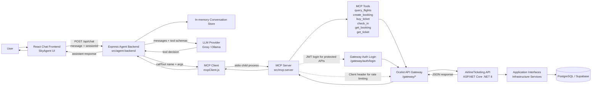
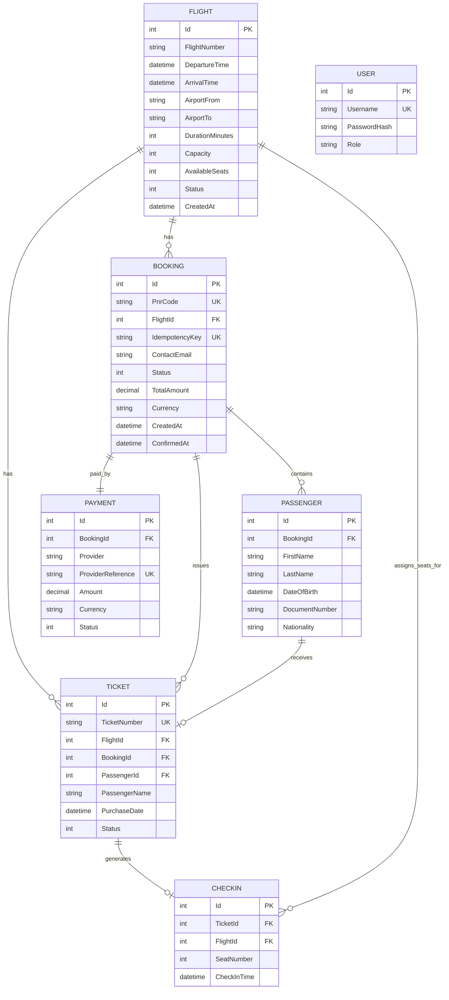

# Airline Ticketing System + SkyAgent AI Agent

SE4458 Software Architecture and Design of Modern Large Scale Systems

Midterm Airline Ticketing API + Assignment 2 AI Agent Chat Application

## Overview

This repository contains a service-oriented airline ticketing system and an AI-powered chat agent named **SkyAgent**.

The midterm part is a backend REST API for an airline ticketing system. It uses .NET 8, ASP.NET Core Web API, Entity Framework Core, PostgreSQL on Supabase, JWT authentication, Swagger, and an Ocelot API Gateway.

The Assignment 2 part adds a natural language AI agent on top of the midterm APIs. A React chat frontend sends user messages to an Express agent backend. The backend sends the conversation and available tool schemas to an LLM. The LLM decides which MCP tool to call. The MCP server maps that tool call to the correct Ocelot Gateway endpoint, and the gateway routes the request to the midterm .NET API.

## Important Links

**GitHub Repository:**
- [Insert GitHub Repository Link Here]

**AI Agent Application Link:**
- [Insert AI Agent App Link Here]

**Demo Video Link:**
- [Insert Demo Video Link Here]

**Backend API Swagger URL:**
- https://backendapi-enhce4cbfrdwh8gb.francecentral-01.azurewebsites.net

**API Gateway URL:**
- https://gatewayasgn-eegrhjd3grb7eqhf.francecentral-01.azurewebsites.net

## Assignment 2 AI Agent Scope

The AI Agent implementation covers the requirements in `doc/Assignment/Assignment_Requirements.md`:

| Requirement | Implementation |
| --- | --- |
| Web or mobile chat frontend | React + Vite chat UI in `src/chat-frontend` |
| Agent backend | Express server in `src/agent-backend` |
| LLM integration | Groq-compatible OpenAI API or local Ollama provider |
| MCP server for airline APIs | Node.js MCP server in `src/mcp-server` |
| LLM decides which MCP tool to call | Tool schemas are passed to the LLM; the agent executes returned tool calls |
| MCP server maps tools to gateway endpoints | `gateway.js` maps MCP tools to `/gateway/*` routes |
| Gateway routes to midterm APIs | Ocelot Gateway routes `/gateway/*` to `/api/v1/*` |
| Midterm APIs called per chat message | User messages can trigger query, booking, ticket, and check-in calls |
| Constant user/password authentication when needed | MCP server logs in as demo user `admin` / `admin123` for protected endpoints |
| Refresh chat via API responses | The assistant response is generated from tool/API results and returned to the frontend |

Firestore, Realtime Database, WebSockets, and Server-Sent Events were optional suggestions in the assignment. This project uses a simple HTTP request-response chat flow: the React UI calls `/api/chat`, and the agent returns the assistant response after the LLM/tool loop completes.

## Architecture Diagram



## Architecture Explanation

The repository is organized around clear service boundaries:

| Layer | Path | Responsibility |
| --- | --- | --- |
| Chat Frontend | `src/chat-frontend` | React + Vite UI where users type natural language flight requests |
| Agent Backend | `src/agent-backend` | Express API, session history, LLM orchestration, MCP client integration |
| MCP Server | `src/mcp-server` | Exposes airline actions as MCP tools and maps them to gateway calls |
| API Gateway | `src/AirlineTicketing.Gateway` | Ocelot route mapping and gateway-level rate limiting |
| Midterm API | `src/AirlineTicketing.API` | ASP.NET Core controllers, Swagger, JWT auth, error middleware |
| Application | `src/AirlineTicketing.Application` | DTOs and service interfaces |
| Infrastructure | `src/AirlineTicketing.Infrastructure` | EF Core DbContext, PostgreSQL access, service implementations |
| Domain | `src/AirlineTicketing.Domain` | Entities and enums |
| Load Tests | `loadtests` | k6 query and ticket load test scripts |

Note: `src/mcp-server` is the standalone MCP server source. The agent backend also contains a bundled MCP server copy under `src/agent-backend/mcp-server`, which is the copy started by `src/agent-backend/src/mcpClient.js` as a stdio child process.

## AI Agent Capabilities

SkyAgent supports the main assignment flows and a few production-oriented extensions:

- Query available flights using natural language.
- Create a full booking / PNR with passenger and payment details.
- Buy ticket using the legacy midterm ticket endpoint.
- Check in a passenger and receive a sequential seat number.
- Look up booking details by PNR code.
- Look up ticket details by ticket number.
- Convert city names to IATA airport codes through the system prompt.
- Convert natural language dates such as "tomorrow" into ISO 8601 dates.
- Ask for missing required parameters before calling tools.
- Avoid inventing passenger names, emails, or contact information.

## MCP Tools

The MCP server exposes these tools to the LLM:

| MCP Tool | Purpose | Gateway Endpoint |
| --- | --- | --- |
| `query_flights` | Search available flights by airports, date range, and passenger count | `GET /gateway/flights/query` |
| `buy_ticket` | Purchase one or more legacy tickets for a flight | `POST /gateway/tickets` |
| `check_in` | Check in a passenger for a flight and assign a seat | `POST /gateway/checkin` |
| `create_booking` | Create a full booking with PNR, passengers, tickets, and demo payment | `POST /gateway/bookings` |
| `get_booking` | Fetch booking details by PNR code | `GET /gateway/bookings/{pnrCode}` |
| `get_ticket` | Fetch ticket details by ticket number | `GET /gateway/tickets/{ticketNumber}` |

The protected tools use JWT authentication. The MCP server authenticates through the gateway, caches the token, and retries once if the token expires.

## Midterm API Requirements Coverage

| Midterm Requirement | Endpoint | Auth | Paging | Status |
| --- | --- | --- | --- | --- |
| Add Flight | `POST /api/v1/Flight` | Yes | No | Implemented |
| Add Flight by File | `POST /api/v1/Flight/upload` | Yes | No | Implemented |
| Query Flight | `GET /api/v1/Flight/query` | No | Yes, max size 10 | Implemented |
| Buy Ticket | `POST /api/v1/Ticket` | Yes | No | Implemented |
| Check-in | `POST /api/v1/CheckIn` | No | No | Implemented |
| Query Flight Passenger List | `GET /api/v1/Flight/passengers` | Yes | Yes, max size 10 | Implemented |

The original academic endpoints are preserved. Additional production-oriented endpoints extend the project with PNR booking, ticket detail, cancellation, boarding, flight status, flight delay, and health checks.

## API Endpoints

| Feature | Endpoint | Auth | Paging |
| --- | --- | --- | --- |
| Add Flight | `POST /api/v1/Flight` | Yes | No |
| Add Flight by File | `POST /api/v1/Flight/upload` | Yes | No |
| Query Flight | `GET /api/v1/Flight/query` | No | Yes, max size 10 |
| Flight Operational Detail | `GET /api/v1/Flight/{flightNumber}` | Yes | No |
| Update Flight Status | `PATCH /api/v1/Flight/{flightNumber}/status` | Yes | No |
| Delay Flight | `PATCH /api/v1/Flight/{flightNumber}/delay` | Yes | No |
| Buy Ticket | `POST /api/v1/Ticket` | Yes | No |
| Ticket Detail | `GET /api/v1/Ticket/{ticketNumber}` | Yes | No |
| Cancel Ticket | `POST /api/v1/Ticket/{ticketNumber}/cancel` | Yes | No |
| Board Passenger | `POST /api/v1/Ticket/{ticketNumber}/board` | Yes | No |
| Check-in | `POST /api/v1/CheckIn` | No | No |
| Query Flight Passenger List | `GET /api/v1/Flight/passengers` | Yes | Yes, max size 10 |
| Login | `POST /api/v1/Auth/login` | No | No |
| Create Booking / PNR | `POST /api/v1/Bookings` | No | No |
| Search Bookings | `GET /api/v1/Bookings` | Yes | Yes, max size 10 |
| Get Booking / PNR | `GET /api/v1/Bookings/{pnrCode}` | Yes | No |
| Update Booking Contact | `PATCH /api/v1/Bookings/{pnrCode}/contact` | Yes | No |
| Cancel Booking / Refund | `POST /api/v1/Bookings/{pnrCode}/cancel` | Yes | No |
| Liveness Health Check | `GET /health/live` | No | No |
| Readiness Health Check | `GET /health/ready` | No | No |

## API Gateway

Ocelot routes gateway paths under `/gateway/*` to backend `/api/v1/*` routes.

| Gateway Path | Backend Path |
| --- | --- |
| `POST /gateway/auth/login` | `POST /api/v1/Auth/login` |
| `POST /gateway/flights` | `POST /api/v1/Flight` |
| `GET /gateway/flights/query` | `GET /api/v1/Flight/query` |
| `POST /gateway/flights/upload` | `POST /api/v1/Flight/upload` |
| `GET /gateway/flights/passengers` | `GET /api/v1/Flight/passengers` |
| `GET /gateway/flights/{flightNumber}` | `GET /api/v1/Flight/{flightNumber}` |
| `PATCH /gateway/flights/{flightNumber}/status` | `PATCH /api/v1/Flight/{flightNumber}/status` |
| `PATCH /gateway/flights/{flightNumber}/delay` | `PATCH /api/v1/Flight/{flightNumber}/delay` |
| `POST /gateway/tickets` | `POST /api/v1/Ticket` |
| `GET /gateway/tickets/{ticketNumber}` | `GET /api/v1/Ticket/{ticketNumber}` |
| `POST /gateway/tickets/{ticketNumber}/cancel` | `POST /api/v1/Ticket/{ticketNumber}/cancel` |
| `POST /gateway/tickets/{ticketNumber}/board` | `POST /api/v1/Ticket/{ticketNumber}/board` |
| `POST /gateway/checkin` | `POST /api/v1/CheckIn` |
| `POST /gateway/bookings` | `POST /api/v1/Bookings` |
| `GET /gateway/bookings` | `GET /api/v1/Bookings` |
| `GET /gateway/bookings/{pnrCode}` | `GET /api/v1/Bookings/{pnrCode}` |
| `PATCH /gateway/bookings/{pnrCode}/contact` | `PATCH /api/v1/Bookings/{pnrCode}/contact` |
| `POST /gateway/bookings/{pnrCode}/cancel` | `POST /api/v1/Bookings/{pnrCode}/cancel` |
| `GET /gateway/health/live` | `GET /health/live` |
| `GET /gateway/health/ready` | `GET /health/ready` |

Rate limiting is configured on `GET /gateway/flights/query`.

- Assignment target: 3 query flight calls per day.
- Current demo setting: 3 query flight calls per minute.
- Required gateway client id header: `Client`.
- MCP requests include the `Client: skyagent-mcp` header so the gateway can identify the agent caller.

The short demo period makes rate limiting easy to verify during Swagger or video demonstrations. For a strict production interpretation of the assignment, change the Ocelot period from `1m` to `1d`.

## Authentication

JWT authentication is used for protected endpoints.

Default seeded user for local/demo testing:

| Field | Value |
| --- | --- |
| Username | `admin` |
| Password | `admin123` |

Protected endpoints require:

```http
Authorization: Bearer <token>
```

The MCP server authenticates through `POST /gateway/auth/login` when a protected tool needs a token. It keeps the JWT in memory and retries authentication once if a protected request returns `401`.

## Data Model

Core entities:

- Flight
- Ticket
- CheckIn
- Booking
- Passenger
- Payment
- User

Important constraints and rules:

- `FlightNumber + DepartureTime` is unique.
- `TicketNumber` is unique.
- `Username` is unique.
- `PnrCode` is unique.
- `IdempotencyKey` is unique when provided.
- `Payment.ProviderReference` is unique.
- A single booking can contain at most 9 passengers.
- A ticket can only be checked in once.
- A seat number can only be assigned once per flight.
- `AvailableSeats` cannot be negative and cannot exceed `Capacity`.
- Cancelled, departed, and arrived flights are excluded from query, ticket purchase, booking, and check-in flows.



## Production-Oriented Booking Request

`POST /api/v1/Bookings` supports the optional `Idempotency-Key` header. Repeating the same key returns the existing booking instead of creating duplicate tickets or consuming extra seats.

```json
{
  "flightNumber": "TK100",
  "departureDate": "2026-06-10T00:00:00Z",
  "contactEmail": "passenger@example.com",
  "contactPhone": "+905551112233",
  "totalAmount": 2500,
  "currency": "TRY",
  "passengers": [
    {
      "firstName": "Ada",
      "lastName": "Yilmaz",
      "dateOfBirth": "1998-05-01T00:00:00Z",
      "documentNumber": "U1234567",
      "nationality": "TUR"
    }
  ]
}
```

## Setup and Run

Runtime configuration is read from environment variables or Azure App Service application settings. Real secrets should not be committed to the repository.

### Required Environment Variables

| Setting | Purpose |
| --- | --- |
| `ConnectionStrings__DefaultConnection` | PostgreSQL/Supabase connection string for the .NET API |
| `JwtSettings__Key` | JWT signing key |
| `GATEWAY_URL` | Gateway base URL used by the MCP server |
| `AUTH_USERNAME` | Demo username for protected API calls |
| `AUTH_PASSWORD` | Demo password for protected API calls |
| `LLM_PROVIDER` | `groq` or `ollama` |
| `GROQ_API_KEY` | Groq API key when `LLM_PROVIDER=groq` |
| `GROQ_MODEL` | Groq model name, default `llama-3.3-70b-versatile` |
| `OLLAMA_HOST` | Ollama host, default `http://localhost:11434` |
| `OLLAMA_MODEL` | Ollama model, default `mistral` |

PowerShell example:

```powershell
$env:ConnectionStrings__DefaultConnection="Host=<supabase-pooler-host>;Database=postgres;Username=<username>;Password=<password>;SSL Mode=Require;Trust Server Certificate=true"
$env:JwtSettings__Key="<long-random-jwt-signing-key>"
$env:GATEWAY_URL="http://localhost:5010"
$env:AUTH_USERNAME="admin"
$env:AUTH_PASSWORD="admin123"
$env:LLM_PROVIDER="groq"
$env:GROQ_API_KEY="<groq-api-key>"
$env:GROQ_MODEL="llama-3.3-70b-versatile"
```

For local Ollama:

```powershell
$env:LLM_PROVIDER="ollama"
$env:OLLAMA_HOST="http://localhost:11434"
$env:OLLAMA_MODEL="mistral"
```

### Build the .NET Solution

```powershell
dotnet build AirlineTicketingSystem.sln /m:1 -v minimal
```

### Run the Backend API

```powershell
dotnet run --project src\AirlineTicketing.API\AirlineTicketing.API.csproj --urls http://localhost:5005
```

Swagger:

```text
http://localhost:5005
```

### Run the API Gateway

```powershell
dotnet run --project src\AirlineTicketing.Gateway\AirlineTicketing.Gateway.csproj --urls http://localhost:5010
```

### Run the Standalone MCP Server

```powershell
cd src\mcp-server
npm install
npm start
```

The standalone MCP server runs over stdio and is mainly useful for MCP inspection/testing. The agent backend starts its bundled MCP server automatically.

### Run the Agent Backend

```powershell
cd src\agent-backend
npm install
cd mcp-server
npm install
cd ..
npm start
```

Agent backend URL:

```text
http://localhost:3001
```

### Run the React Chat Frontend

```powershell
cd src\chat-frontend
npm install
npm run dev
```

Frontend URL:

```text
http://localhost:3000
```

The Vite dev server proxies `/api/*` requests to `http://localhost:3001`.

Build the frontend:

```powershell
cd src\chat-frontend
npm run build
```

## Demo Script

This flow can be used for the recorded demo video.

1. Introduce the architecture:
   - React chat frontend
   - Express agent backend
   - LLM tool calling
   - MCP server
   - Ocelot Gateway
   - Midterm .NET API
   - PostgreSQL/Supabase database

2. Query flights:

```text
Find flights from Istanbul to Frankfurt tomorrow for 1 person
```

Expected behavior: the agent converts the city names to IATA codes, calculates the date range, calls `query_flights`, and shows available flights.

3. Start a booking:

```text
I want to book flight TK100 for tomorrow
```

Expected behavior: the agent asks for missing passenger/contact information instead of inventing it.

4. Provide passenger information:

```text
My name is Batikan Akdeniz and my email is batikan@example.com
```

Expected behavior: the agent calls `create_booking` or the appropriate ticketing tool and returns booking/ticket details.

5. Check in:

```text
Check in Batikan Akdeniz for flight TK100 tomorrow
```

Expected behavior: the agent calls `check_in`, and the API returns the transaction status and assigned seat number.

## CSV Upload Format

The upload endpoint expects a CSV file with this header/order:

```csv
FlightNumber,DepartureTime,ArrivalTime,AirportFrom,AirportTo,DurationMinutes,Capacity
TK100,2026-06-10T08:00:00Z,2026-06-10T10:00:00Z,ADB,IST,120,180
```

The upload response includes created, skipped, and failed row counts. Invalid rows are reported instead of being silently ignored.

## Load Testing

k6 scripts are included under `loadtests/`.

Tested endpoints:

- Query Flight: `loadtests/query-loadtest.js`
- Buy Ticket: `loadtests/ticket-loadtest.js`

Required scenarios:

- Normal Load: 20 virtual users
- Peak Load: 50 virtual users
- Stress Load: 100 virtual users
- Duration: at least 30 seconds per scenario

Example commands:

```powershell
k6 run -e VUS=20 -e DURATION=30s loadtests\query-loadtest.js
k6 run -e VUS=50 -e DURATION=30s loadtests\query-loadtest.js
k6 run -e VUS=100 -e DURATION=30s loadtests\query-loadtest.js
```

For ticket load tests, provide a valid JWT and a flight with enough capacity:

```powershell
k6 run -e VUS=20 -e DURATION=30s -e TOKEN=<jwt> -e FLIGHT_NUMBER=<flight> -e DEPARTURE_DATE=2026-06-10T00:00:00Z loadtests\ticket-loadtest.js
```

Previous load test summary:

| Test | VUs | Avg ms | p95 ms | RPS | Error Rate |
| --- | ---: | ---: | ---: | ---: | ---: |
| Query Flight | 20 | 19.3 | 44.2 | 1028.9 | 0% |
| Query Flight | 50 | 51.6 | 90.5 | 963.7 | 0% |
| Query Flight | 100 | 97.7 | 140.0 | 1019.2 | 0% |
| Buy Ticket | 20 | 24.0 | 72.0 | 830.9 | 0% |
| Buy Ticket | 50 | 67.1 | 209.9 | 743.8 | 0% |
| Buy Ticket | 100 | 147.7 | 450.2 | 674.5 | 0% |

**Load Test Screenshots / Graphs:**
- [Insert Load Test Screenshots or Graph Link Here]

## Design Assumptions

- A flight is uniquely identified by `FlightNumber + DepartureTime`.
- Buy Ticket and Check-in receive `FlightNumber + Date`; if multiple flights with the same number exist on the same day, the earliest matching flight is used.
- Query Flight excludes flights whose available seats are less than the requested number of people.
- Query paging is clamped to a maximum page size of 10.
- Seat assignment is sequential per flight.
- The legacy Buy Ticket endpoint is preserved for the assignment.
- The production-oriented booking path creates a PNR, passengers, issued tickets, and a demo captured payment in one transaction.
- AI Agent API calls go through the gateway.
- The AI Agent uses constant demo credentials for protected API calls.
- The agent must ask for passenger details and must not invent names, emails, or phone numbers.
- Local Ollama or Groq can be used as the LLM provider.
- Firestore, Realtime Database, WebSockets, and SSE are not used because the current chat flow is synchronous HTTP request-response.

## Production-Oriented Extensions

- Booking lifecycle: PNR creation, ticketed booking status, passenger records, and payment status.
- Overbooking prevention: ticket purchase and booking both decrement capacity atomically in the database.
- Idempotency: `Idempotency-Key` prevents duplicate booking creation during client retries.
- Check-in consistency: seat assignment runs in a transaction and the database enforces unique seat numbers per flight.
- Flight lifecycle: flight status prevents selling or checking in cancelled, departed, or arrived flights.
- Health checks: liveness verifies application process health, readiness verifies database connectivity and migration state.
- Error handling: unhandled service exceptions are returned as consistent JSON error envelopes with request metadata.

## Issues Encountered

- **LLM hallucinations:** Smaller models sometimes generated fake successful responses or fake passenger names. The system prompt now explicitly requires missing passenger details before calling `buy_ticket` or `create_booking`.
- **Rate limiting:** Ocelot blocked the MCP server until the `Client` header was added to gateway requests. MCP now sends `Client: skyagent-mcp`.
- **Authentication:** Some airline endpoints are protected by JWT. The MCP server logs in through the gateway and reuses the token for protected tools.
- **Provider flexibility:** The agent supports Groq for hosted LLM calls and Ollama for local model usage.
- **Azure availability:** Hosted App Service URLs can have cold-start or availability delays, so the project can also be demonstrated locally.

## Verification

Commands used to verify the project:

```powershell
dotnet build AirlineTicketingSystem.sln /m:1 -v minimal
```

```powershell
cd src\chat-frontend
npm run build
```

```powershell
node --check src\agent-backend\src\index.js
node --check src\agent-backend\src\agent.js
node --check src\agent-backend\src\mcpClient.js
node --check src\mcp-server\src\index.js
node --check src\mcp-server\src\gateway.js
```

Latest local verification:

- .NET solution build: passed.
- React frontend production build: passed.
- Node syntax checks for agent/MCP files: passed.
- NuGet vulnerability lookup may warn when `https://api.nuget.org/v3/index.json` is unreachable, but the solution can still build from restored packages.

## Notes

- Database: PostgreSQL on Supabase.
- The Supabase pooler connection string is used because the direct database host can require IPv6.
- Secrets should be provided through environment variables or Azure App Service settings.
- `appsettings.json` keeps empty placeholders for sensitive local/runtime values.
